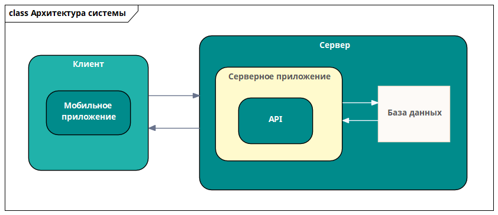
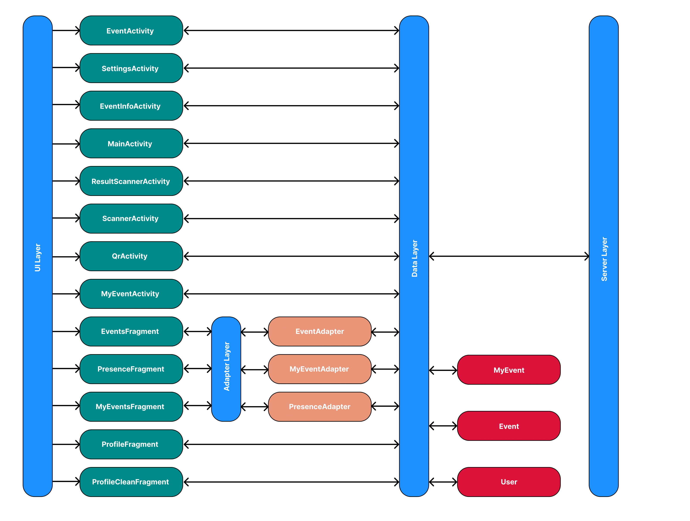

# Архитектура подсистемы 

## Общая архитектура системы 

Общая архитектура системы представляет собой набор из двух компонентов:
клиентским мобильным приложением и сервером. Обмен данными
осуществляется в двустороннем формате. Серверное приложение обрабатывает
запросы, взаимодействует с базой данным и отправляет результат в виде
JSON-файла. Клиент обращается к серверу и получает данные, которые
использует для заполнения соответствующих полей графического интерфейса.

Рисунок 1 -- Архитектура системы

В качестве данных выступают: список проводимых мероприятий с открытой
регистрацией, информация о необходимом мероприятии, перечень участников
мероприятия, информация об авторизованном пользователе.

## Архитектура мобильного приложения 

Мобильное приложение использует многослойную архитектуру построения,
представленную четырьмя частями: UI Layer, Adapter Layer, Data Layer и
Api Layer.

Рисунок 2 -- Архитектура приложения

Первым является слой UI Layer, предназначенный для обработки
взаимодействия пользователя с графическим интерфейсом. Данный слой
состоит из набора activity-контроллеров. Контроллеры считывают действия
человека с элементами интерфейса и соответствующим образом реагируют на
них, демонстрируя необходимые данные. Activity представлены двумя
типами:

1.  классы Activity -- обслуживание компонентов основных окон
    приложения;

2.  классы Fragment -- обслуживание дополнительных окон интерфейса.

Слой Adapter Layer используется при необходимости работы со списками. Он
включает в себя классы-адаптеры, выступающие в качестве компоновщиков
моделей в карточки графического интерфейса:

1.  EventAdapter -- преобразование объектов типа Event в карточки
    мероприятий;

2.  MyEventAdapter -- преобразование объектов типа MyEvent в карточки
    мероприятий, на которые зарегистрировался студент;

3.  PresenceAdapter -- преобразование объектов типа MyEvent в карточки
    мероприятий для проведения ответственным;

Data Layer задействуется для преобразования полученных из Api Layer
данных в объекты data-классов. Всего в приложении имеется три таких
класса:

1.  Event -- предназначен для хранения мероприятий;

2.  MyEvent -- класс для хранения мероприятий, на которые пользователь
    зарегистрировался;

3.  User -- предназначен для хранения информации об авторизованном в
    системе пользователе.

Для взаимодействия с серверными API используется слой Server Layer.
Server Layer применяется для выполнения и обработки серверных запросов.
Он содержит в себе набор методов для обращения к серверу и преобразует
полученный результат в объекты data-классов из Data Layer.
