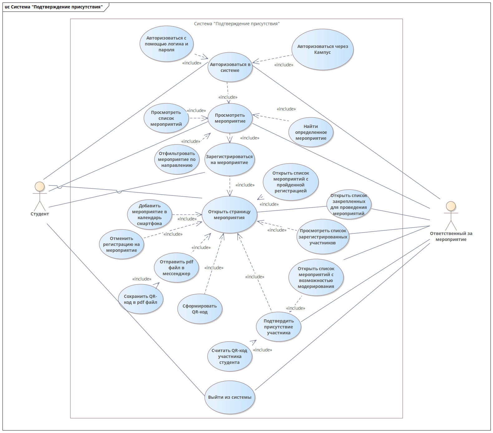

# Диаграмма вариантов использования 

Для описания функционала разрабатываемого программного модуля была
спроектирована диаграмма вариантов использования системы. В системе
выделены два активных субъекта: студент и ответственный за мероприятие.
Студент использует приложение для просмотра и регистрации на участие в
мероприятиях. Ответственный за мероприятие -- для подтверждения
присутствия участников.

Рисунок 1 -- Диаграмма вариантов использования

---

**Спецификация варианта использования «Авторизоваться в системе»**

**Цель**: авторизоваться в ИС для дальнейшего функционального
взаимодействия.

**Активные субъекты**: студент, ответственный за мероприятие.

**Краткое описание**: активный субъект авторизуется в ИС.

**Основной поток событий**:

1.  активный субъект запускает приложение;

2.  приложение запускается и открывает окно «Мероприятия»;

3.  активный субъект нажимает на вкладку «Пользователь»;

4.  приложение открывает соответствующее окно;

5.  активный субъект заполняет текстовые поля логина и пароля;

6.  активный субъект нажимает кнопку «Войти»;

7.  приложение проверяет текстовые поля на валидацию;

8.  при успешном прохождении процедуры валидации приложение отправляет
    запрос для авторизации на сервер, при неудачном -- сообщает об
    ошибке;

9.  приложение получает результат запроса;

10. при успешном результате запроса для авторизации приложение изменяет
    окно пользователя на окно успешной авторизации, при неудачном --
    сообщает об ошибке;

11. приложение изменяет набор вкладок приложения в соответствии с ролью
    активного субъекта.

**Альтернативные потоки событий:**

1.  активный субъект запускает приложение;

2.  приложение запускается и открывает окно «Мероприятия»;

3.  активный субъект нажимает на вкладку «Пользователь»;

4.  приложение открывает соответствующее окно;

5.  активный субъект нажимает кнопку «Войти через личный кабинет»;

6.  приложение загружает окно авторизации;

7.  активный субъект заполняет текстовые поля логина и пароля;

8.  активный субъект нажимает кнопку «Войти»;

9.  приложение проверяет текстовые поля на валидацию;

10. при успешном прохождении процедуры валидации приложение отправляет
    запрос для авторизации на сервер, при неудачном -- сообщает об
    ошибке;

11. приложение получает результат запроса;

12. при успешном результате запроса для авторизации приложение изменяет
    окно пользователя на окно успешной авторизации, при неудачном --
    сообщает об ошибке;

13. приложение изменяет набор вкладок приложения в соответствии с ролью
    активного субъекта.

**Специальные требования**: учетная запись в системе «Кампус» для
альтернативного потока событий.

**Предусловия**: нет

**Постусловия**: возможность взаимодействия с модулями «Мероприятия»,
«Мои мероприятия», «Подтверждение присутствия», «Создание мероприятия».

**Дополнительные замечания**:

1.  взаимодействие с модулем «Подтверждение присутствия» доступна только
    для субъектов с ролью «Ответственный за мероприятие»;

2.  взаимодействие с модулем «Мероприятия» доступно пользователю, не
    прошедшему авторизацию, но в ограниченном режиме.

---

**Спецификация варианта использования «Просмотреть мероприятие»**

**Цель**: просмотр списка мероприятий.

**Активные субъекты**: студент, ответственный за мероприятие.

**Краткое описание**: активный студент просматривает информацию о
мероприятии.

**Основной поток событий**:

1.  активный субъект нажимает на вкладку «Мероприятия»;

2.  приложение открывает соответствующее окно;

3.  приложение формирует запрос на сервер для получения списка
    мероприятий;

4.  сервер получает запрос и отправляет результат со списком
    мероприятий;

5.  приложение получает результат запроса и формирует карточки
    мероприятий;

6.  активный субъект просматривает карточки мероприятий;

7.  активный субъект применяет фильтр мероприятий;

8.  приложение производит фильтрацию списка мероприятий по
    соответствующему критерию;

9.  активный субъект использует поиск мероприятия по названию;

10. приложение производит поиск мероприятий по названию;

11. активный субъект открывает необходимое мероприятие.

**Альтернативные потоки событий:** нет.

**Специальные требования**: нет.

**Предусловия**: нет.

**Постусловия**: возможность открытия необходимого мероприятия для
ознакомления с информацией.

**Дополнительные замечания**:

1.  пункты с 7 по 10 основного потока событий являются опциональными и
    могут быть применены как независимо друг от друга, так и не
    применяться.

---

**Спецификация варианта использования «Зарегистрироваться на
мероприятие»**

**Цель**: регистрация студента на мероприятие.

**Активные субъекты**: студент.

**Краткое описание**: активный субъект регистрируется на выбранное
мероприятие для участия.

**Основной поток событий**:

1.  активный субъект открывает полное описание мероприятия;

2.  приложение формирует запрос на получение необходимого набора данных
    о мероприятии;

3.  сервер получает запрос и формирует ответ;

4.  приложение получает ответ и заполняет поля данными о мероприятии;

5.  активный субъект нажимает кнопку «Участвовать»;

6.  приложение отправляет запрос на сервер о регистрации нового
    участника;

7.  сервер регистрирует нового участника и отправляет результат;

8.  приложение уведомляет активного субъекта о результате регистрации.

**Альтернативные потоки событий:**

1.  активный субъект находит необходимое мероприятие в списке
    мероприятий;

2.  активный субъект нажимает кнопку «Участвовать»;

3.  приложение отправляет запрос на сервер о регистрации нового
    участника;

4.  сервер регистрирует нового участника и отправляет результат;

5.  приложение уведомляет активного субъекта о результате регистрации.

**Специальные требования**: нет.

**Предусловия**: успешно завершен сценарий «Авторизоваться в системе».

**Постусловия**: возможность выполнения сценария «Открыть страницу
мероприятия».

**Дополнительные замечания**: нет.

---

**Спецификация варианта использования «Открыть страницу мероприятия»**

**Цель**: взаимодействие с мероприятием.

**Активные субъекты**: студент, ответственный за мероприятие.

**Краткое описание**: активный субъект открывает страницу мероприятия с
пройденном регистрацией.

**Основной поток событий**:

1.  активный субъект нажимает на вкладку «Мои мероприятия»;

2.  приложение формирует запрос на получение необходимого набора данных
    о мероприятиях пользователя с пройденной регистрацией;

3.  сервер получает запрос и формирует ответ;

4.  приложение получает ответ и заполняет карточки мероприятий;

5.  активный субъект нажимает на необходимую карточку;

6.  приложение отправляет запрос на сервер для получения информации о
    выбранном мероприятии;

7.  сервер получает запрос и формирует результат;

8.  приложение получает результат и заполняет поля данными о
    мероприятиями;

9.  приложение формирует QR-код по полученному от сервера ключу;

10. активный субъект нажимает кнопку «Отменить регистрацию»;

11. приложение формирует соответствующий запрос и отправляет его на
    сервер;

12. сервер получает запрос, удаляет запись об участии активного субъекта
    и отправляет результат;

13. приложение получает результат запроса и информирует активного
    субъекта;

14. пользователь нажимает на кнопку сохранения информации о мероприятии
    в pdf-файл;

15. приложение считывает необходимые данные из результата запроса;

16. приложение запускает механизм создания pdf-файла;

17. файл сохраняется в памяти устройства;

18. приложение информирует пользователя о результате;

19. пользователь нажимает на кнопку отправки файла;

20. приложение запускает механизм создания pdf-файла;

21. файл сохраняется в памяти устройства;

22. приложение запускает окно отправления сохраненного файла;

23. пользователь нажимает на кнопку добавления записи в календарь
    устройства;

24. приложение считывает необходимые данные из результата запроса;

25. приложение вызывает календарь устройства и передает подготовленные
    данные.

**Альтернативные потоки событий:** нет.

**Специальные требования**:

1.  активный субъект нажимает на вкладку «Мои мероприятия»;

2.  приложение формирует запрос на получение необходимого набора данных
    о мероприятиях с возможностью модерирования;

3.  сервер получает запрос и формирует ответ;

4.  приложение получает ответ и заполняет карточки мероприятий;

5.  активный субъект нажимает на необходимую карточку;

6.  приложение отправляет запрос на сервер для получения информации о
    выбранном мероприятии;

7.  активный субъект нажимает кнопку «Статистика мероприятия»

8.  приложение отправляет запрос на сервер для получения информации об
    участниках мероприятия;

9.  сервер обрабатывает запрос и отправляет результат;

10. приложение получает результат и заполняет элементы интерфейса
    данными.

**Предусловия**: успешно завершены сценарии «Авторизоваться в системе» и
«Зарегистрироваться на мероприятие».

**Постусловия**: нет.

**Дополнительные замечания**:

1.  пункты с 10 по 25 основного потока событий являются опциональными и
    могут быть применены как независимо друг от друга, так и не
    применяться;

2.  альтернативный поток событий описывает сценарий для пользователя с
    ролью «Ответственный за мероприятие».

---

**Спецификация варианта использования «Подтвердить присутствие
участника»**

**Цель**: подтверждение присутствия участника на мероприятии.

**Активные субъекты**: ответственный за мероприятие.

**Краткое описание**: ответственный за мероприятие подтверждает
присутствие студента на мероприятии.

**Основной поток событий**:

1.  активный субъект нажимает на вкладку «Подтверждение присутствия»;

2.  приложение формирует запрос на получение необходимого набора данных
    о мероприятиях пользователя с возможностью модерирования;

3.  сервер получает запрос и формирует ответ;

4.  приложение получает ответ и заполняет карточки мероприятий;

5.  активный субъект нажимает на необходимую карточку;

6.  приложение открывает окно QR-код сканера;

7.  активный студент считывает QR-код студента;

8.  приложение отправляет запрос для проверки регистрации студента и
    подтверждения присутствия на сервер;

9.  сервер обрабатывает запрос и отправляет результат;

10. приложение получает результат и уведомляет активного субъекта о
    результате.

 **Альтернативные потоки событий:** нет.

**Специальные требования**: нет.

**Предусловия**: активный субъект имеет доступ к модерации мероприятия.

**Постусловия**: нет.

**Дополнительные замечания**: нет.

---

**Спецификация варианта использования «Выйти из системы»**

**Цель**: выход из системы.

**Активные субъекты**: студент, ответственный за мероприятие.

**Краткое описание**: пользователь выходит из аккаунта с помощью
механизма выхода.

**Основной поток событий**:

1.  активный субъект нажимает на вкладку «Пользователь»;

2.  приложение открывает соответствующее окно;

3.  активный субъект нажимает на кнопку «Выйти из аккаунта»;

4.  приложение удаляет информацию о текущем пользователе и изменяет
    набор вкладок приложения в соответствии с изначальным состоянием без
    авторизованного пользователя.

**Альтернативные потоки событий:** нет.

**Специальные требования**: нет.

**Предусловия**: выполнен сценарий «**Авторизоваться в системе**».

**Постусловия**: нет.

**Дополнительные замечания**: нет.
