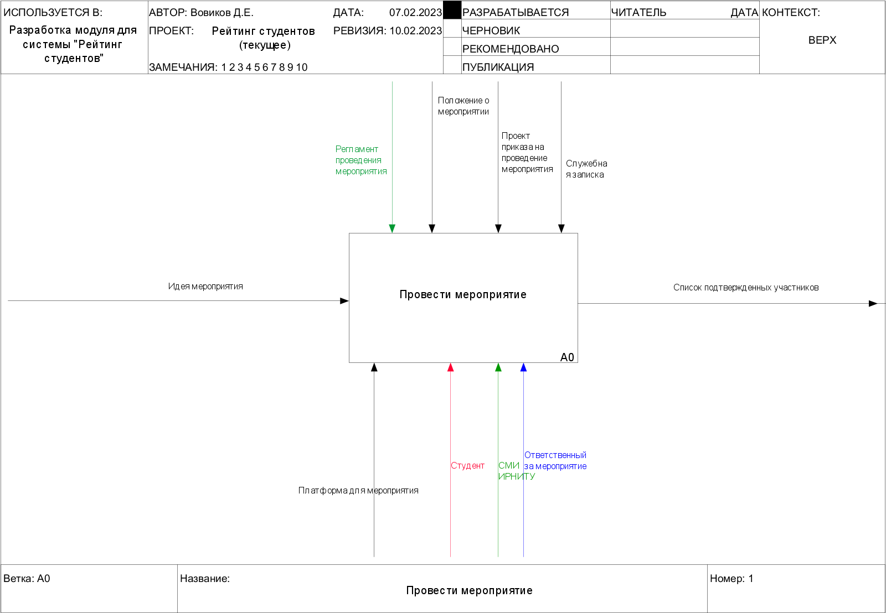
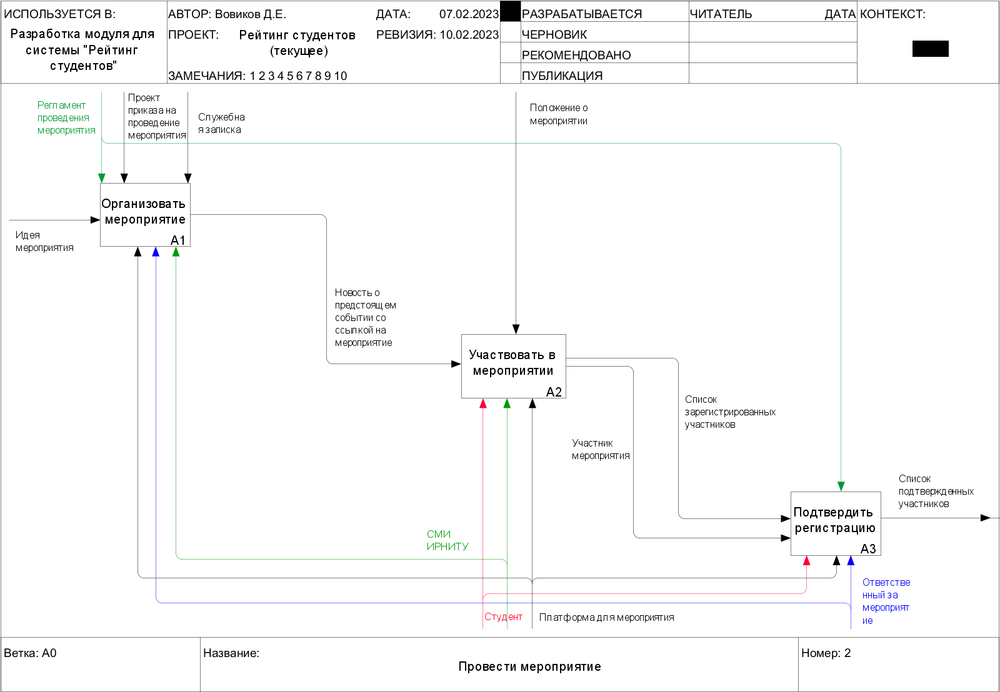
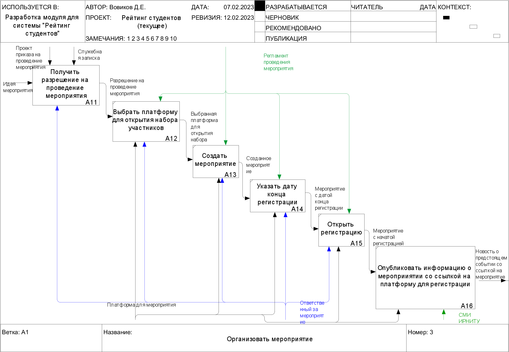
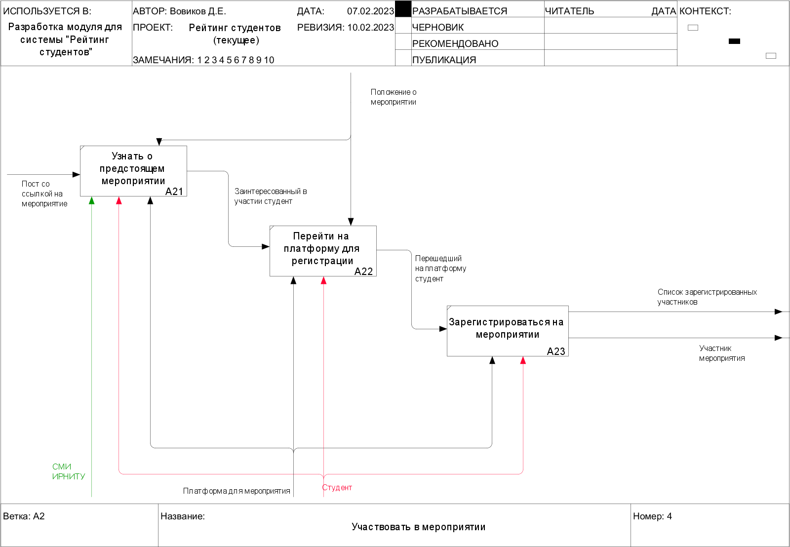
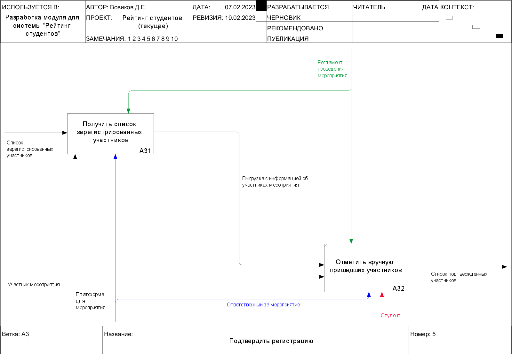

# Текущее представление модели {#текущее-представление-модели .Вовиков-Заголовок1}

Для представления текущих процессов проведения мероприятия была
использована методология моделирования IDEF0.

{width="5.002204724409449in"
height="3.4651246719160107in"}

Рисунок 1 -- Блок А0

**Блок А0:** блок А0 представляет из себя полный процесс организации
мероприятия, регистрации участников с последующим подтверждением
присутствия. Контекст данного блока представлен тремя модулями
«Организовать мероприятие», «Участвовать в мероприятии» и «Подтвердить
регистрацию».

{width="5.420133420822397in"
height="3.7532469378827646in"}

Рисунок 2 -- Детализация блока А0

**Блок А1:** представляет из себя несколько процессов, описывающих
процедуру организации мероприятия и распространение информации о нем с
помощью СМИ ИРНИТУ.

На вход в данный блок поступает идея будущего мероприятия.

В качестве механизмов выступают СМИ ИРНИТУ, ответственный за мероприятие
и платформа для мероприятия.

Управление данным процессом осуществляется за счет регламента проведения
мероприятия, проекта приказа на проведение мероприятия и служебной
записки.

Выходом из данного блока является новость о предстоящем событии со
ссылкой на мероприятие.

**Блок А2:** активные студенты узнают из СМИ информацию о предстоящем
мероприятии, переходят на соответствующую платформу и регистрируются в
качестве участников.

На вход в данный блок поступает новость о предстоящем событии со ссылкой
на мероприятие.

В качестве механизмов выступают СМИ ИРНИТУ, студент и платформа для
мероприятия.

Управление данным процессом осуществляется за счет положения о
мероприятии.

Выходами из данного блока являются участник мероприятия и список
зарегистрированных участников.

**Блок А3:** зарегистрированные участники посещают мероприятие, на
котором проходят этап ручной регистрации. На основании чего создается
список подтвержденных участников.

На вход в данный блок поступают участник мероприятия и список
зарегистрированных участников.

В качестве механизмов выступают студент, ответственный за мероприятие и
платформа для мероприятия.

Управление данным процессом осуществляется за счет регламента проведения
мероприятия.

Выходом из данного блока является список подтвержденных участников.

{width="6.496527777777778in"
height="4.498611111111111in"}

Рисунок 3 -- Детализация блока А1

**Блок А11**: ответственный за мероприятие подготавливает проект
приказа, служебную записку для предстоящего мероприятия и получает
разрешение для последующего проведения.

На вход в данный блок поступает идея мероприятия.

В качестве механизмов выступает ответственный за мероприятие.

Управление данным процессом осуществляется за счет проекта приказа на
проведение мероприятия и служебной записки.

Выходом из данного блока является разрешение на проведение мероприятия.

**Блок А12**: после получения разрешения на проведение мероприятия
ответственный выбирает платформу для открытия набора участников на
событие. В качестве платформ выступают Leader-ID, Яндекс Формы и Google
Формы.

На вход в данный блок поступает разрешение на проведение мероприятия.

В качестве механизмов выступают ответственный за мероприятие и платформа
для мероприятия.

Управление данным процессом осуществляется за счет регламента проведения
мероприятия.

Выходом из данного блока является выбранная платформа для открытия
набора.

**Блок А13**: на выбранной платформе начинается процесс создания
мероприятия. На данном этапе заполняются поля заголовка мероприятия и
его описания, при необходимости, добавляются графические изображения,
соответствующие тематике мероприятия, указываются дата, время и место
проведения.

На вход в данный блок поступает выбранная платформа для открытия набора.

В качестве механизмов выступают ответственный за мероприятие и платформа
для мероприятия.

Управление данным процессом осуществляется за счет регламента проведения
мероприятия.

Выходом из данного блока является созданное мероприятие.

**Блок А14**: на данном этапе ответственный за мероприятие указывает
дату конца работы механизма регистрации на созданное мероприятие.

На вход в данный блок поступает созданное мероприятие.

В качестве механизмов выступают ответственный за мероприятие и платформа
для мероприятия.

Управление данным процессом осуществляется за счет регламента проведения
мероприятия.

Выходом из данного блока является мероприятие с датой конца регистрации.

**Блок А15**: после завершения подготовки мероприятия и заполнения всех
необходимых полей ответственный за мероприятие запускает механизм начала
регистрации на мероприятие.

На вход в данный блок поступает мероприятие с датой конца регистрации.

В качестве механизмов выступают ответственный за мероприятие и платформа
для мероприятия.

Управление данным процессом осуществляется за счет регламента проведения
мероприятия.

Выходом из данного блока является мероприятие с начатой регистрацией.

**Блок А16**: на данном этапе ответственный за мероприятие отправляет
ссылку со страницей мероприятия в СМИ ИРНИТУ для подготовки новости о
предстоящем событии.

На вход в данный блок поступает мероприятие с начатой регистрацией.

В качестве механизмов выступают СМИ ИРНИТУ, платформа для мероприятия.

Выходом из данного блока является новость о предстоящем событии со
ссылкой на мероприятие.

{width="6.496527777777778in"
height="4.498611111111111in"}

Рисунок 4 -- Детализация блока А2

**Блок А21**: студенты ИРНИТУ узнают о предстоящем мероприятии через СМИ
ИРНИТУ.

На вход в данный блок поступает пост со ссылкой на мероприятие.

В качестве механизмов выступают студент, платформа для мероприятия, СМИ
ИРНИТУ.

Управление данным процессом осуществляется за счет положения о
мероприятии.

Выходом из данного блока является заинтересованный в участии студент.

**Блок А22**: заинтересованный в участии студент переходит на платформу
для регистрации в мероприятии через ссылку на страницу события на
платформе.

На вход в данный блок поступает заинтересованный в участии студент.

В качестве механизмов выступают студент и платформа для мероприятия.

Управление данным процессом осуществляется за счет положения о
мероприятии.

Выходом из данного блока является перешедший на платформу студент.

**Блок А23**: после перехода на платформу для регистрации и последующего
ознакомления с описанием мероприятия студент записывается на событие в
качестве участника. Новый участник помещается в список
зарегистрированных участников мероприятия.

На вход в данный блок поступает перешедший на платформу студент.

В качестве механизмов выступают студент и платформа для мероприятия.

Выходами из данного блока являются список зарегистрированных участников
и участник мероприятия.

{width="6.496527777777778in"
height="4.498611111111111in"}

Рисунок 5 -- Детализация блока А3

**Блок А31**: после завершения процесса регистрации на мероприятие
ответственный за мероприятие получает выгрузку участников события из
платформы для последующего подтверждения присутствия студентов.

На вход в данный блок поступает список зарегистрированных участников.

В качестве механизмов выступают платформа для мероприятия, ответственный
за мероприятие.

Управление данным процессом осуществляется за счет регламента проведения
мероприятия.

Выходом из данного блока является выгрузка с информацией об участниках
мероприятия.

**Блок А32**: участники мероприятия посещают событие, на котором
проходят процедуру регистрации: отмечают свое присутствие среди
участников в списке мероприятия.

На вход в данный блок поступает выгрузка с информацией об участниках
мероприятия.

В качестве механизмов выступают ответственный за мероприятие, студент.

Управление данным процессом осуществляется за счет регламента проведения
мероприятия.

Выходом из данного блока является список подтвержденных участников.
