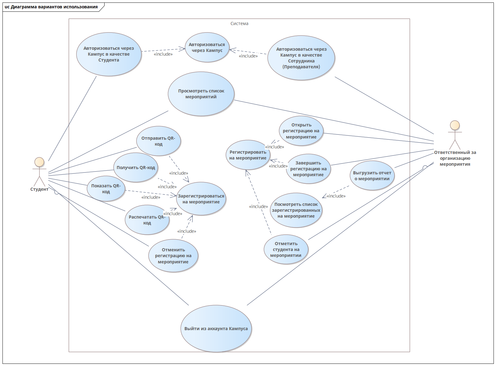

Разрабатываемая система предусматривает два варианта использования (в зависимости от роли пользователя): студента и ответственного за организацию мероприятия.

Определение варианта использования приложения основывается на данных авторизованного аккаунта через систему «Кампус ИрНИТУ».

**Вариант студента:**

При авторизации через «Кампус ИрНИТУ» пользователю представлен набор мероприятий с изображением (опционально) и кратким описанием мероприятия. При выборе мероприятия открывается окно с полной информацией о событии и кнопкой для регистрации. При нажатии на соответствующую на нее пользователь получает QR-код. QR-код предполагает возможность распространения посредством сохранения в pdf-файл с кодом и/или отправления pdf в социальную сеть/мессенджер.

  
 Рисунок 1 – Демонстрация возможности отправки сообщения 

QR-код содержит в себе поле guid. Приложение получает сгенерированный guid и связывает его с пользователем в базе данных.

В качестве дополнительного функционала предполагается разработка web-сайта, выполняющего аналогичный функционал.  

**Вариант ответственного за организацию мероприятия:**

Данный вариант представлен в виде следующих компонентов:

1. Мобильное приложение для сканирования QR-кодов
1. Web-сайт для работы с мероприятиями и статистикой.

**Мобильное приложение:**

При авторизации через Кампус пользователю доступен следующий набор возможностей:

1. Сканирование QR-кода участника мероприятия
1. Просмотр информации об участниках мероприятия

**Web-сайт**

1. Просмотр списка мероприятий
1. Возможность объявления начала регистрации/завершения   регистрации на мероприятие
1. Просмотр статистики мероприятия
1. Получение выгрузки по результатам мероприятия.

  
 Рисунок 2 – Диаграмма вариантов использования системы 
